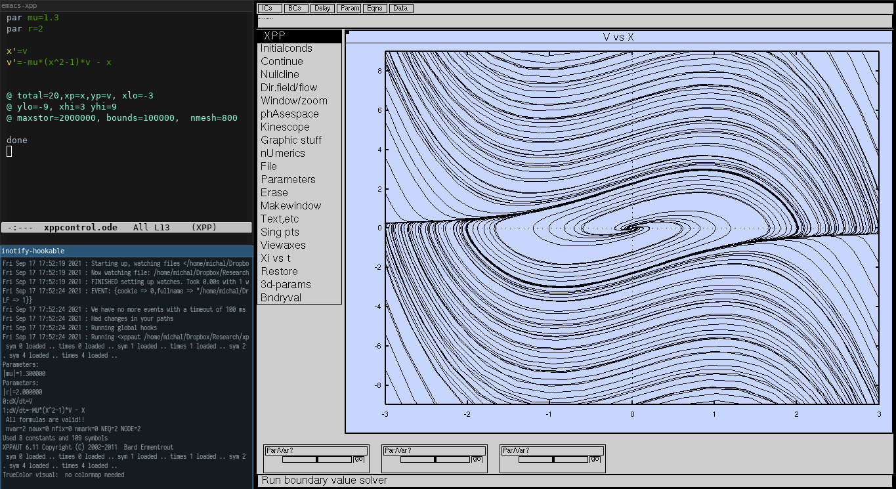
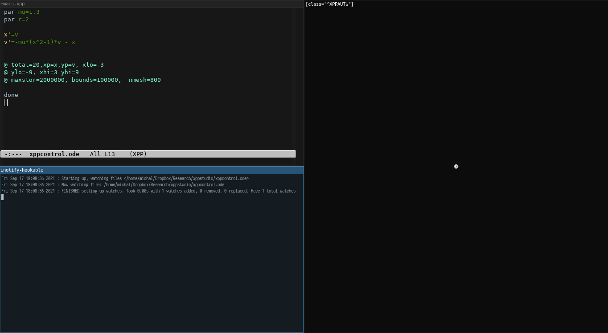

# XppStudio

#### XppStudio na system Linux Debian

1. Instalacja programów składających się na XppStudio. Wszystkie pogramy można
zainstalować z konsoli za pomocą komendy: `sudo apt get install i3-wm xppaut
emacs inotify-hookable rxvt-unicode`

   * i3-wm: https://i3wm.org/
   * Xpp: http://www.math.pitt.edu/~bard/xpp/xpp.html
   * Emacs: https://www.gnu.org/software/emacs/
   * inotify-hookable: https://packages.debian.org/pl/testing/inotify-hookable
   * rxvt-unicode: https://packages.debian.org/testing/rxvt-unicode
   
2. Konfiguracja menadżera okien i3-wm
   * Konfiguracja ułożenia okien za pomocą pliku _workspace\_xpp.json_: do
	 uzyskania tego pliku należy podzielić okna ręcznie (lub za pomocą skryptu)
	 wpisując w dmenu ($mod+d) odpowiednie komendy np.
	 1. xppaut xppcontrol.ode
	 2. i3-msg "split horizontal"
	 3. emacs -q -l emacs-xpp --name
	 emacs-xpp
	 4. Przesunąć kursor na okno programu Emacs i przesunąć je w lewą stronę za
        pomocą skrótu klawiszowego $mod+Shift+Left. 'Left' oznacza strzałkę w
        lewo.
	 5. i3-msg "split vertical" 
	 6. urxvt -name \"koszyk\" -e inotify-hookable -d -f xppcontrol.ode -c
        \"xppaut xppcontrol.ode\""	 
	 7. i3-save-tree > _workspace\_xpp.json_	
	 
   * Za pomocą programu _xprop_ można sprawdzić własności okien, aby odpowiednio
	 zmodyfikować konfiguracje w pliku _workspace-ps.json_
	 
   * Napisanie skryptu _ps\_workspace.sh_ uruchamiającego poszczególne programy,
     które mają znaleźć się w odpowiednich oknach, określonych w pliku
     workspace-ps.json

   * Stworzenie skrótu klawiszowego uruchamiającego XppStudio: dodanie do
	 pliku config znajdującego się w folderze ~/.config/i3 linii `bindsym $mod+x exec
	 $HOME/Dropbox/Research/xppstudio/xpp_workspace.sh`

4. Uruchomienie XppStudio
   * Po naciśnięciu skrótu klawiszowego w przestrzeni roboczej 3, uruchomi się
     XppStudio (numer przestrzeni roboczej możemy zmienić w pliku
     _ps_workspace.sh_) 
   * Komunikacja pomiędzy Emacs a Xpp rozpoczyna się po zapisaniu zmian do pliku
     _xppcontrol.ode_. Gdy wprowadzimy pierwszą zmianę, to pojawi się
     Xpp. Uruchamianie Xpp po każdej zapisanej zmianie do pliku odbywa się po
     naciśnięciu raz Ctrl-c w okonie _inotify-hookable_. Gdy naciśniemy dwa
     razy, zakończymy działanie Xpp.
 
